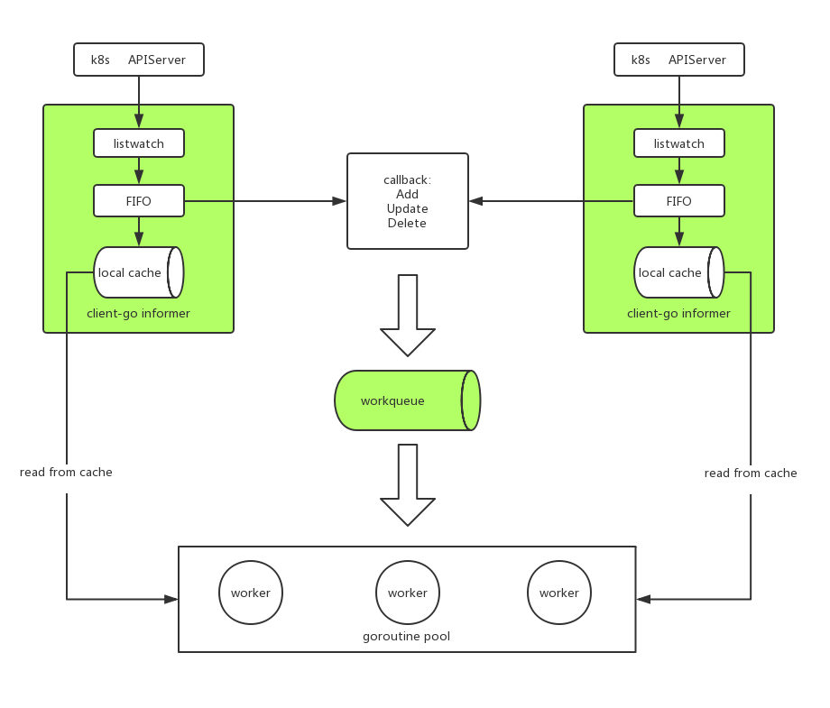

### Robot

基于 client-go 实现 k8s 多集群的资源调度。

#### 架构


#### 例子
```$xslt
package main

import (
	"fmt"
	"time"

	"gitlab.mfwdev.com/servicemesh/robot"
)

func main() {
	r, err := robot.NewRobot([]string{}, []string{"../config/pioneer"})
	if err != nil {
		panic(err)
	}
	r.Discover([]robot.Resource{robot.Services, robot.Endpoints}, []string{"default/productpage"})
	go r.Run()

	for {
		obj, _ := r.Pop()
		if err := process(obj); err != nil {
			_ = r.ReQueue(obj)
		} else {
			r.Finish(obj)
		}
	}
}

func process(obj robot.QueueObject) error {
	// your own logic
	fmt.Println(time.Now(), obj.Event, obj.RType, obj.Key)
	return nil
}
```
