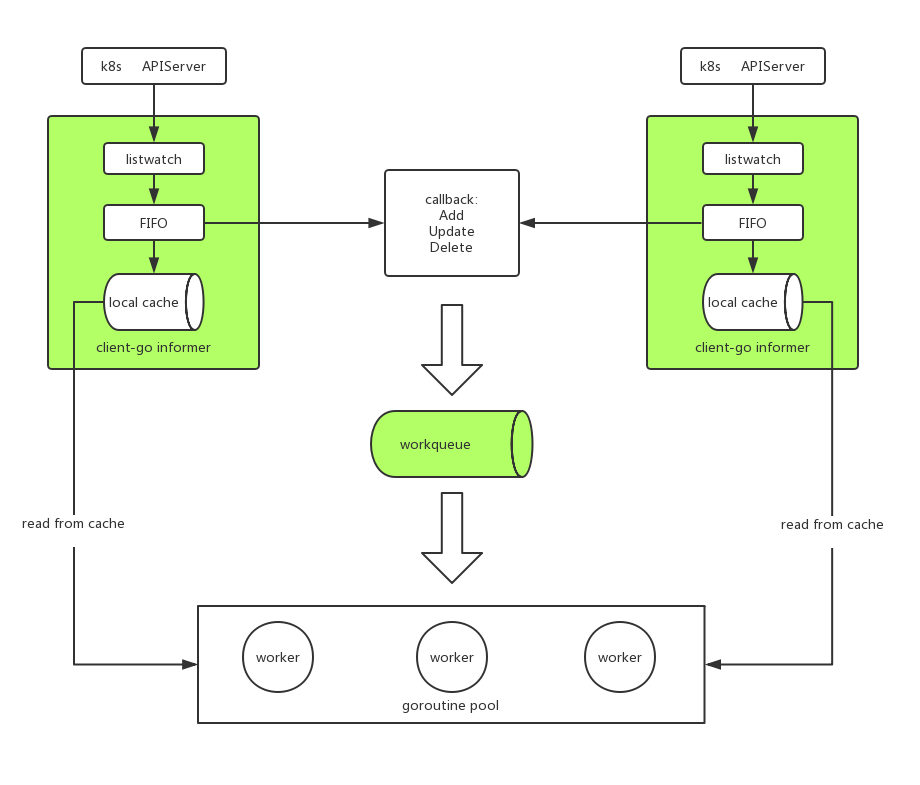

### Robot

基于 client-go 实现 k8s 多集群的资源调度。

#### 架构

#### 例子

    package main
    
    import (
    	"fmt"
    	"robot"
    )
    
    func main() {
    	r, err := robot.NewRobot([]string{}, []string{"/Users/zy/.kube/config39", "/Users/zy/.kube/config37"})
    	if err != nil {
    		panic(err)
    	}
    	r.Discover([]robot.Resource{robot.Endpoints, robot.Pods}, "default")
    	go r.Run()
    
    	for {
    		obj, _ := r.Pop()
    		fmt.Println(obj.Typ, obj.Key)
    
    		fmt.Println(r.ListKeys(), len(r.ListKeys()))
    	}
